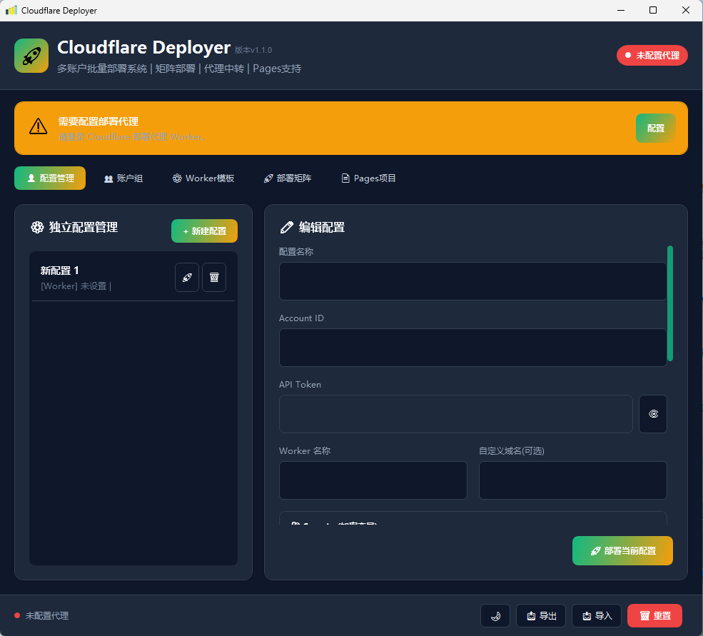
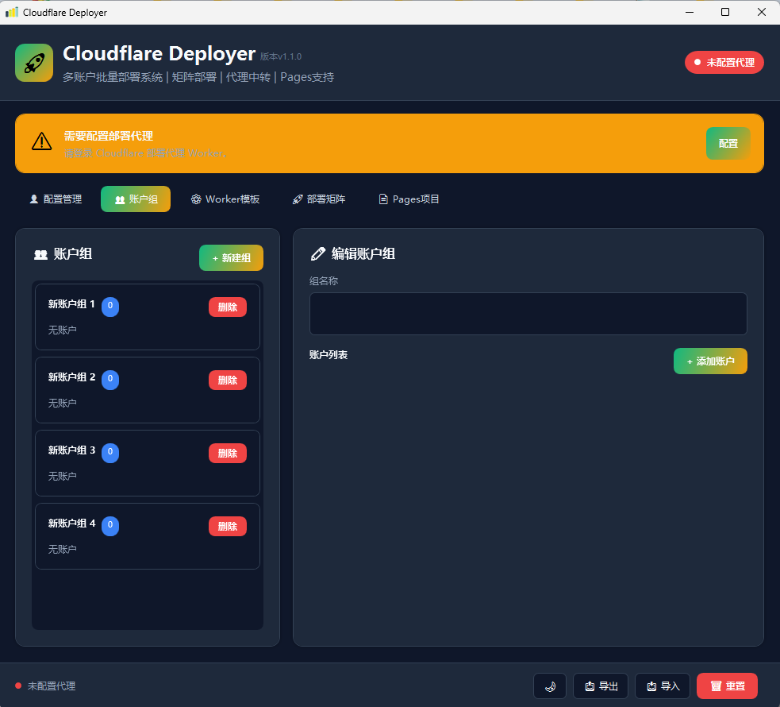
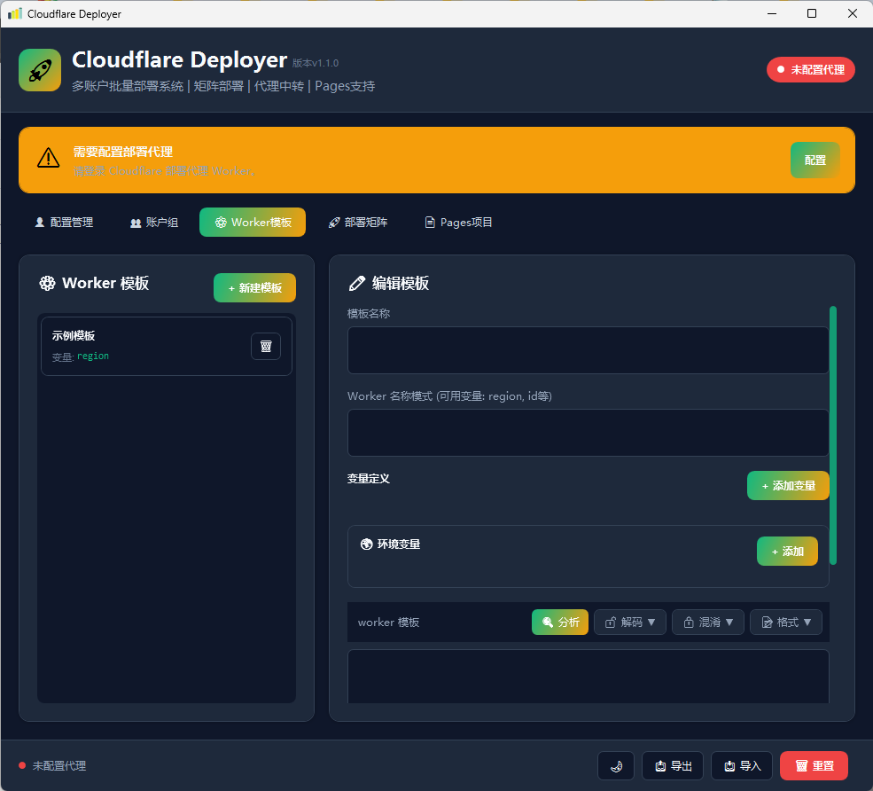
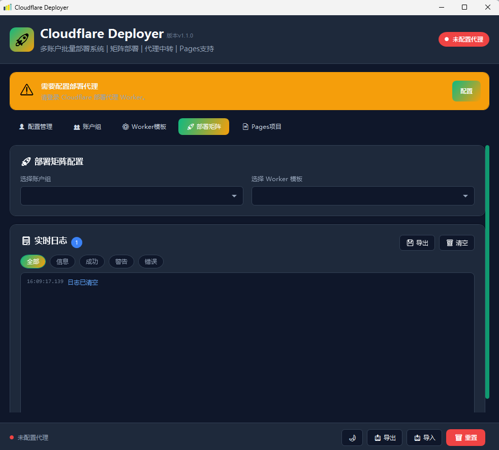
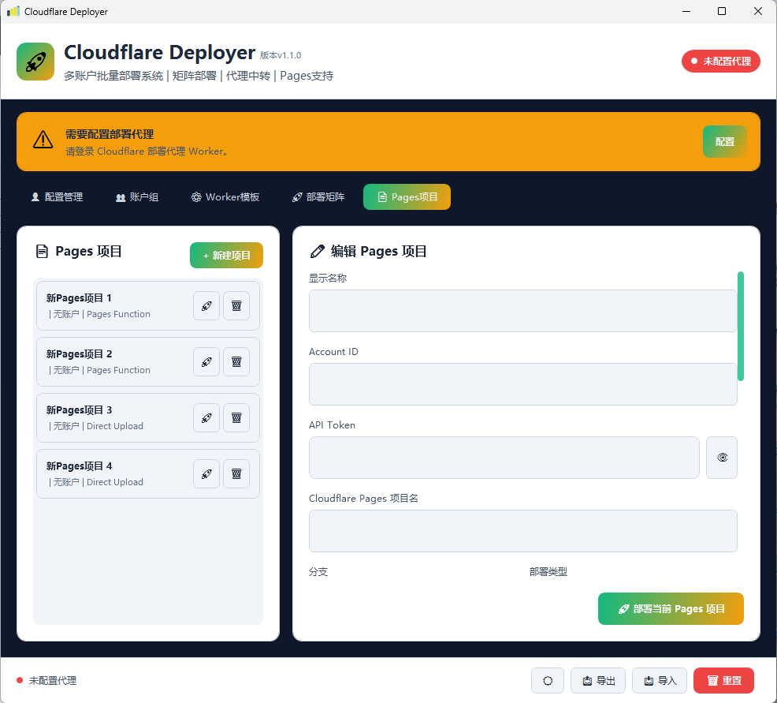
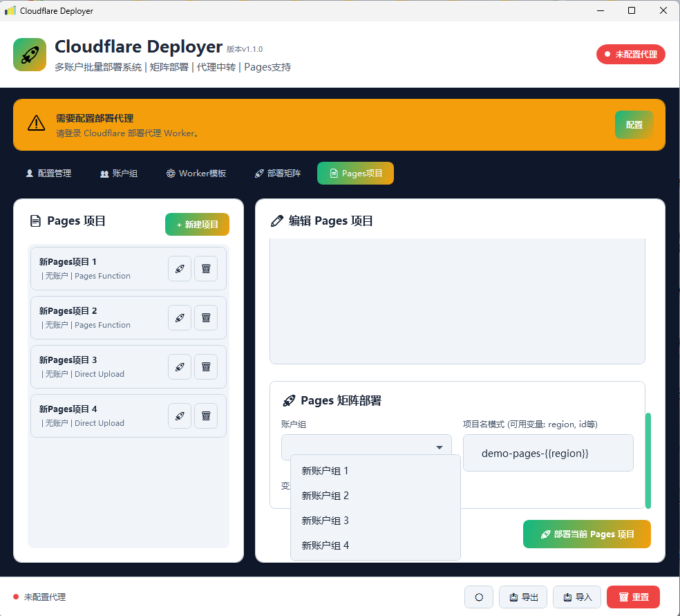

# ☁️ Cloudflare Deployer

一款基于 WPF (.NET 8) 开发的 Windows 桌面应用，用于批量部署和管理 **Cloudflare Worker** 与 **Cloudflare Pages** 项目。

---

## 📋 项目概述

CFDeployer 提供可视化界面，支持多账号管理、代码编辑、批量矩阵部署、日志追踪等功能，帮助开发者高效管理 Cloudflare 无服务器应用部署。

### 核心特性

| 特性 | 说明 |
|------|------|
| 🔧 独立配置管理 | 支持多个 Worker / Pages 配置独立管理 |
| 👥 账户组管理 | 将多个 Cloudflare 账号分组，便于批量操作 |
| 📋 Worker 模板 | 支持变量化模板，一键生成多环境、多地域 Worker |
| 📄 Pages 项目管理 | 直连 Cloudflare API 部署 Pages，支持 Direct Upload 和 Pages Function |
| 🚀 矩阵部署 | 基于账户组 × 变量组合，批量生成并部署 Worker / Pages 实例 |
| 🌐 代理中转 | Worker 部署支持通过自建 Cloudflare Worker 代理绕过 CORS |
| 🛠️ 代码处理 | 内置代码分析、Base64/Unicode/Hex 编解码、混淆、格式化 |
| 🎨 主题切换 | 支持深色 / 浅色主题 |

---

## 📸 界面预览

### 配置管理页


### 账户组页


### worker模板页


### 部署矩阵页


### Pages 项目页



---

## 🚀 快速开始

### 环境要求

- Windows 10 / Windows 11
- [.NET 8.0 SDK](https://dotnet.microsoft.com/download/dotnet/8.0) 或更高版本

### 编译运行

```bash
# 克隆项目后进入目录
cd CFDeployer

# 编译
dotnet build

# 运行
dotnet run

# 发布单文件（可选）
dotnet publish -c Release
```

> 如果本地只安装了 .NET 9 SDK，可将 `global.json` 中的 `rollForward` 改为 `latestMajor`。

---

## 🏗️ 项目结构

```
CFDeployer/
├── App.xaml                        # WPF 应用入口，全局资源
├── App.xaml.cs                     # 应用启动类、值转换器
├── MainWindow.xaml                 # 主窗口 UI
├── MainWindow.xaml.cs              # 主窗口逻辑（配置/账户/模板/部署/Pages）
├── MainViewModel.cs                # 视图模型（部署命令封装）
├── CFDeployer.csproj               # 项目文件（.NET 8 WPF）
├── global.json                     # SDK 版本约束
├── app.ico                         # 应用图标
├── app.manifest                    # DPI 感知清单
├── build.bat                       # 编译脚本
├── README.md                       # 项目说明
├── 项目结构.md                     # 详细项目结构文档
├── 使用说明.html                   # 详细使用说明（HTML）
│
├── Models/                         # 数据模型
│   ├── AccountGroup.cs             # 账户组模型
│   ├── AppData.cs                  # 应用全局数据
│   ├── DeployJob.cs                # 部署任务 + 矩阵项
│   ├── DeployTarget.cs             # 部署目标枚举（Worker/Pages）
│   ├── LogEntry.cs                 # 日志条目
│   ├── PagesProject.cs             # Pages 项目模型
│   ├── Profile.cs                  # 独立配置（Worker/Pages）
│   └── WorkerTemplate.cs           # Worker 模板 + Pages 模板字段
│
├── Services/                       # 业务服务
│   ├── DeployService.cs            # Worker 部署服务（代理中转）
│   ├── PagesDeployService.cs       # Pages Direct Upload 直连部署
│   ├── StorageService.cs           # JSON 数据持久化
│   └── WorkerCodeProcessor.cs      # 代码编码/解码/混淆/格式化
│
├── Controls/                       # 自定义控件
│   ├── CodeEditor.xaml             # 代码编辑器 XAML
│   └── CodeEditor.xaml.cs          # 代码编辑器逻辑
│
└── Dialogs/                        # 弹窗
    ├── ProxyConfigDialog.xaml      # 代理配置弹窗
    └── ProxyConfigDialog.xaml.cs   # 代理配置逻辑
```

---

## 🌐 代理配置（Worker 部署必需）

由于 Cloudflare Worker 部署 API 使用 `multipart/form-data`，WPF 桌面应用直接调用会受 CORS 限制，因此 **Worker 部署必须通过一个中间代理 Worker 转发**。

Pages 部署直连 `api.cloudflare.com`，**不需要代理**。

### 配置步骤

1. 在 Cloudflare 上创建一个代理 Worker，暴露 `/deploy/single` 端点
2. 代理 Worker 将请求转发到 Cloudflare Workers API
3. 打开 CFDeployer，点击顶部代理状态按钮
4. 填入代理 Worker URL（如 `https://your-proxy.your-subdomain.workers.dev`）

---

## ⚙️ Worker 部署

1. 切换到 **👤 配置管理** Tab
2. 点击 **+ 新建配置**
3. 填写 Account ID、API Token、Worker 名称
4. 编辑 Worker 代码
5. 点击 **🚀 部署当前配置**

### API Token 权限

- `Cloudflare Workers:Edit`
- `Account:Read`
- 如需自定义域名：`Zone:Edit`

---

## 📄 Pages 部署

1. 切换到 **📄 Pages项目** Tab
2. 点击 **+ 新建项目**
3. 填写 Account ID、API Token、Pages 项目名
4. 选择分支和部署类型
5. 填写静态文件目录（可点击 **浏览...** 选择本地文件夹）
6. 点击 **🚀 部署当前 Pages 项目**

### 部署类型

| 类型 | 说明 |
|------|------|
| 直接上传 | 直接上传静态文件生成 Deployment |
| Pages Function（含 Worker） | 上传静态文件的同时包含 `_worker.js` |

### API Token 权限

- `Cloudflare Pages:Edit`
- `Account:Read`

---

## 🚀 矩阵批量部署

### Worker 矩阵

1. 切换到 **🚀 部署矩阵** Tab
2. 选择账户组和 Worker 模板
3. 填写模板变量值（逗号分隔）
4. 选择要部署的任务
5. 点击 **开始批量部署**

### Pages 矩阵

1. 切换到 **📄 Pages项目** Tab
2. 在右侧下方的 **Pages 矩阵部署** 区域选择账户组
3. 填写项目名模式（如 `pages-{{region}}`）
4. 填写变量值（逗号分隔）
5. 选择任务后点击 **开始批量部署**

---

## 🛠️ 代码处理工具

在配置管理页和模板编辑页的代码区域上方提供：

- 🔍 **分析**：代码行数、注释数、复杂度、常用模式检测
- 🔓 **解码**：Base64 / Unicode / Hex 解码
- 🔒 **混淆**：Base64 编码、轻度混淆、中度混淆
- 📝 **格式**：代码格式化、代码压缩

---

## 📸 更多截图

### 深色主题


### 代理配置弹窗


---

## 📝 更新日志

### v1.1.0 (2026-07-04)

- ✨ 新增 Cloudflare Pages 项目部署支持
- ✨ 新增 Pages 矩阵批量部署
- ✨ 新增 Pages Direct Upload 和 Pages Function 两种部署模式
- ✨ 新增静态文件目录浏览按钮
- 🐛 修复 `IsDeploying` 状态赋值错误
- 🐛 修复 Base64 编码使用 `atob` 错误（改为 `btoa`）
- 🐛 修复 `AccountId` 空值导致的异常
- ♻️ 移除 `MainWindow` 中重复的部署方法，统一部署入口到 `DeployService`
- 🛡️ Pages 部署内置 429 限流保护和自动重试

### v1.0.1 (2026-03-01)

- ✨ 新增代码分析、解码、混淆、格式化功能
- ✨ 新增 Worker 模板变量替换支持
- 💄 优化日志筛选与导出功能

### v1.0.0 (2026-02-28)

- 🎉 初始版本发布
- 多账户批量部署系统
- 矩阵部署、代理中转功能
- 账户组管理、Worker 模板管理

---

## ⚠️ 安全提示

API Token 当前以明文形式存储在 `%AppData%/CFDeployer/data.json` 中。请勿在公共或不安全的计算机上保存敏感 Token。

---

## 📄 详细文档

- [项目结构.md](./项目结构.md)
- [使用说明.html](./使用说明.html)
